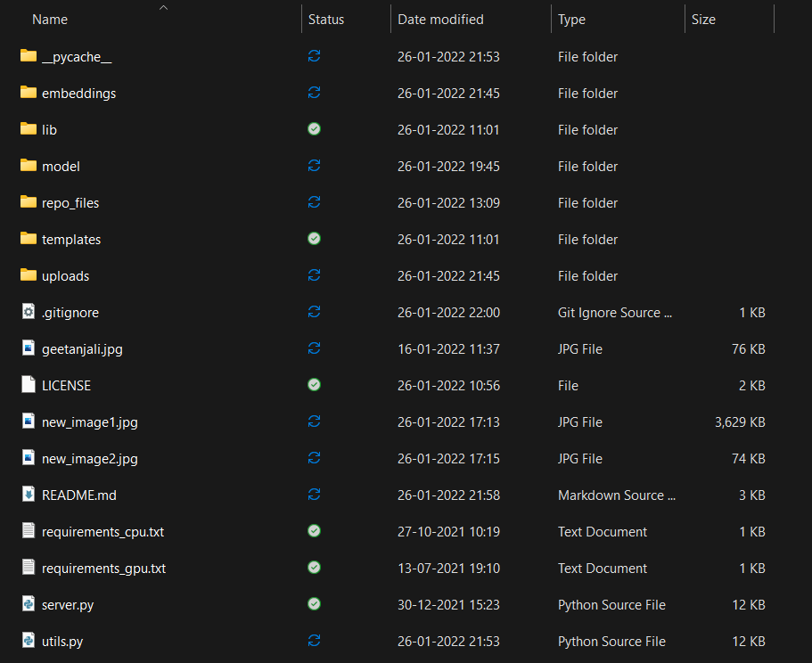
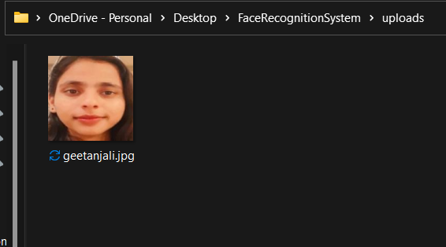
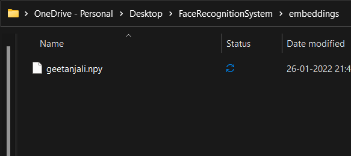
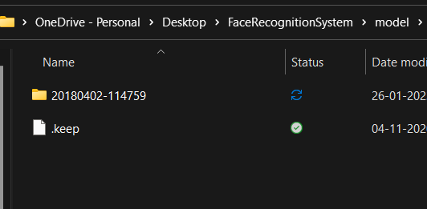

# Face Recognition System

## _biometrics authentication_


Face Recognition System is a tool which is used to keep track of user's identity and later on used to predict the identity of a person.
The system can store 1000s of individual identities at the same time and can predict the identity very precisely.

The project directory:-
</br>
The server home:-
</br>
Identity image upload:-
</br>
Result of prediction:-
</br>
uploads directory:-
</br>
embeddings directory:-
</br>

## Features

- Register a new user using a single image
- Can store 1000s of individual identities
- Prediction is very accurate
- Very clean and simple User Interface
- Runs both on CPU and GPU
- Using a GPU can boost the prediction speed
- All the uploaded person's identity images can be found in the uploads directory
- A person's deep learning represented embedding is stored in embeddings directory

## Tech

Face Recognition System uses opensource deep learning models.
The project is written in **python**

Major frameworks used :-

- **Numpy** - Used for numerical computation
- **Tensorflow** - Deep learning library used to create the FaceNet model
- **cv2** - Open source computer vision library used to read the model and perform predictions
- **flask** - To create the GUI of the web application

## Installation

Face Recognition System requires **python 3.6** to run

1. clone this repository to your system using:
```
git clone https://github.com/geetanjalirec/FaceRecognitionSystem.git
```
2. Download the model folder from google drive https://drive.google.com/drive/folders/1sOxzgzYrQZ49vOFYscUT2z_TI-8Z_5w_?usp=sharing
3. Copy the folder '20180402-114759' to the model folder

4. Download all the dependencies:

For running on CPU run the command
```
python -m pip install -r requirements_cpu.txt
```
For running on GPU run the commmand
```
python -m pip install -r requirements_gpu.txt

```
5. If all the dependencies are propely installed then you can run the project successfully.

## Running
To run the server use the command:
```
python server.py
```
